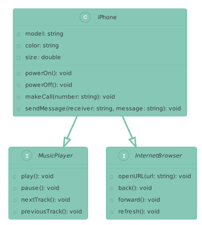

# Iphone UML

A UML (Unified Modeling Language) project representing an iPhone's roles as a Music Player, Phone, and Internet Browser.
## UML Diagram

The UML diagram provided here illustrates the classes and interfaces for the iPhone project, depicting the relationships between them.

